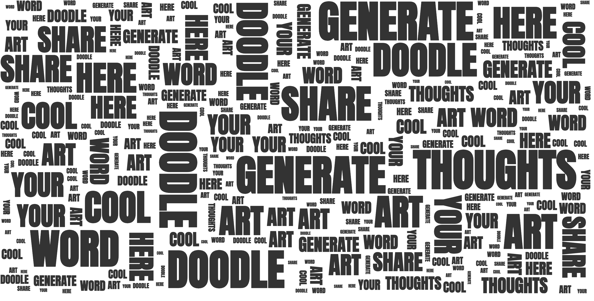
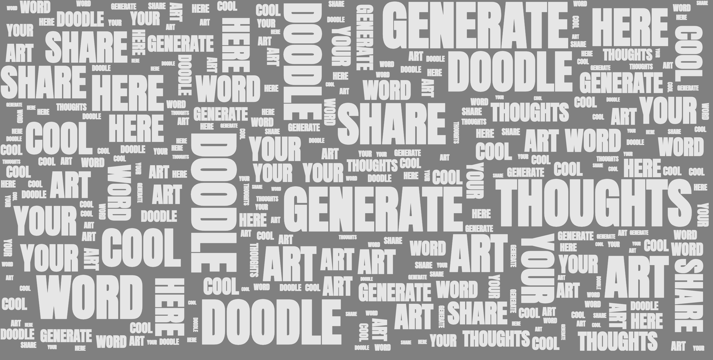
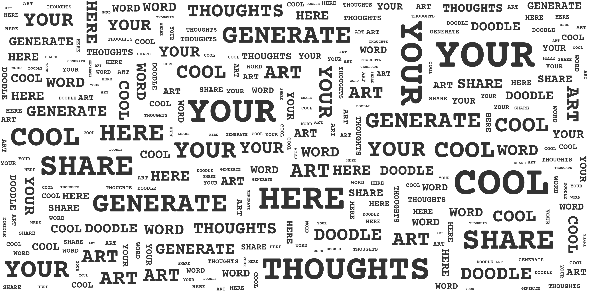
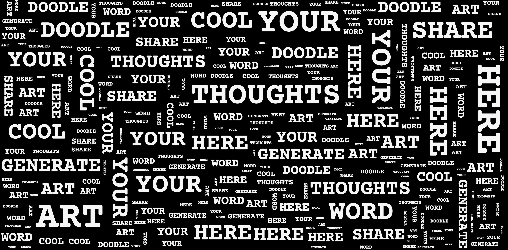
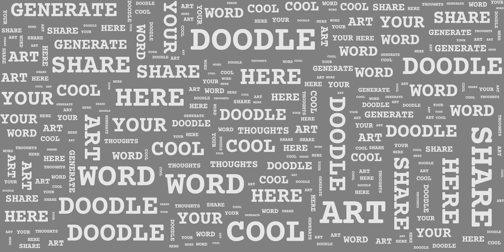
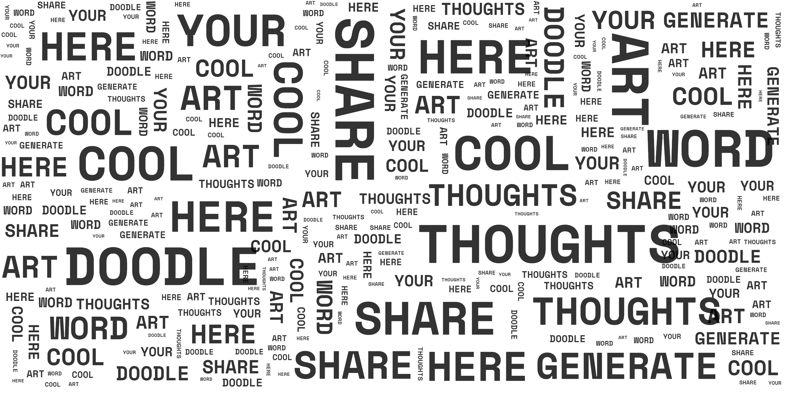
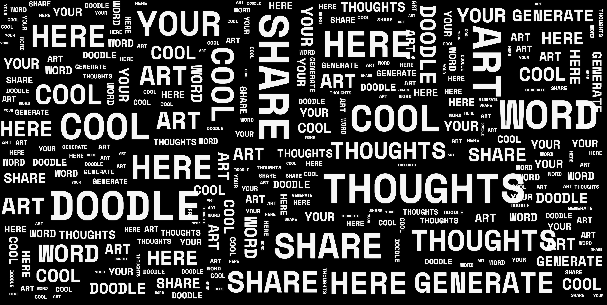
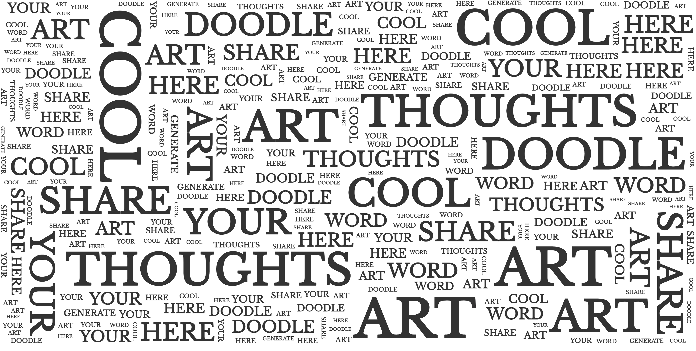
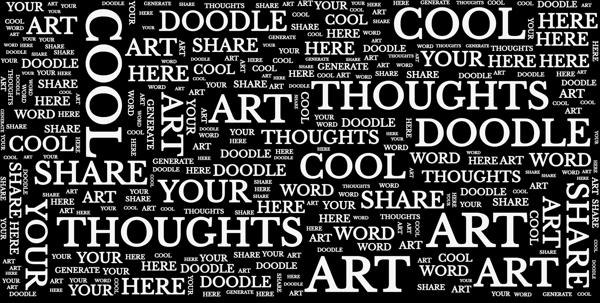
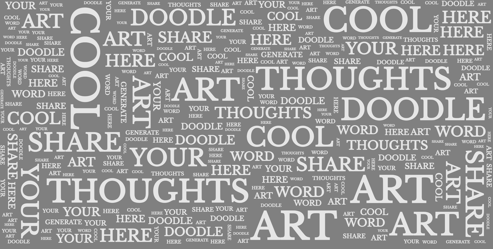

# [word-doodle](https://j-ncel.github.io/word-doodle/)

A browser-based generative text art engine that takes string of text and transforms them into typographic doodles. **word-doodle** scatters words across the screen using a simple collision detection algorithm to place words into empty spaces. It includes a control hub where users can input text, change fonts, select text cases, and apply word limits with additional options to generate the doodle, wipe the screen, or take a screenshot.

**[Live Demo](https://j-ncel.github.io/word-doodle/)**

## Samples

| Font Style        |                     White Theme                      |                     Black Theme                      |                     Gray Theme                      |
| :---------------- | :--------------------------------------------------: | :--------------------------------------------------: | :-------------------------------------------------: |
| **Anton**         |        |        |        |
| **Courier Prime** |      |      |      |
| **Space Mono**    |    |    |    |
| **Baskerville**   |  |  |  |

## Doodle Control Hub

The **Doodle Hub** is a floating, interactive interface that allows you to configure and generate your **word-doodle** art in real-time.

- **Source Text:** Input the specific text you wish to transform into a typographic doodle.
- **Font Selection:** Choose from distinct fonts, including _Anton_, _Courier Prime_, _Space Mono_, and _Baskerville_.
- **Text Case:** Instantly toggle the canvas between **UPPERCASE**, **lowercase**, and **Title Case**.
- **Word Limit:** Set a maximum word count to control the density of your composition.
- **Dynamic Theming:** Switch between **White**, **Black**, and **Gray** environments to change the canvas aesthetic.
- **Screenshot Engine:** Export high-resolution, 2x scaled PNGs of your artwork (powered by `html2canvas`).
- **Wipe Canvas:** Quickly clear the viewport to reset the stage for a fresh generation.

---

## The Engine

**The word-doodle engine transforms raw text into organized art via a three-step generation pipeline:**

**1. Vocabulary Analysis & Frequency Mapping**

When text is provided, the engine parses the string into individual tokens. It converts all words to a uniform uppercase format to ensure accurate counting. Then it calculates how many times each unique word appears, identifying the `maxFrequency` to establish visual weight for each word.

**2. Word Weight Scaling**

- **Size:** `fontSize` is determined by a random base value scaled by the word's frequency weight.
- **Weight:** High-frequency words (above **80%** weight) are automatically assigned a `fontWeight` of **700** for extra impact.
- **Orientation:** To make it more visual appealing, there is a **15% chance** a word will rotate 90°, switching to a vertical placement.

**3. Collision Detection**

- **Coordinate Generation:** The engine picks a random $(x, y)$ coordinate within the viewport.
- **Boundary Validation:** It compares the candidate's bounding box against every word already placed on the canvas, including a **5px safety padding**.
- **The Retry Loop:** If an overlap is detected, the engine attempts to find a new spot. It will try up to **70 different positions** before skipping the word. This prevents infinite loops and keeps the browser performance smooth even with high word counts.

> The generation happens via `requestAnimationFrame`, allowing you to watch the "doodle" evolve in real-time without locking the browser UI.

## License

This project is licensed under the **MIT License**. You are free to use, modify, and distribute this software. See the `LICENSE` file in the repository for full details.
